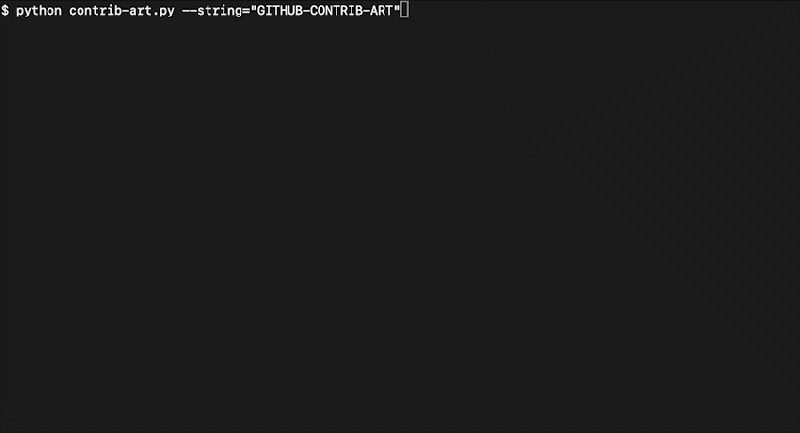
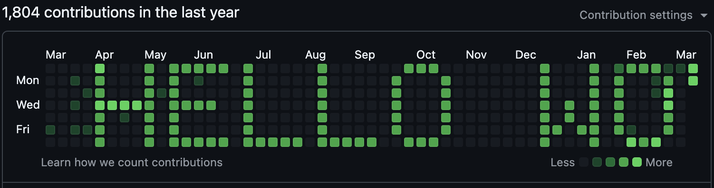

# Github Contrib Art




**Github Contrib Art** is python script allows you to use your Github Contribution Activity graph as a billboard of artistic self-expression. Each pixel’s grayscale intensity can be mapped to a specific number of commits, allowing you to create patterns or designs in your GitHub contribution graph.

### How to Use

1. **Clone this Repository**: Clone the repository to your local machine.

```bash
git clone <url>
```

2. **Create a New GitHub Repository**: Do not fork, create a brand-new repo in your GitHub account. The Contrib Activity graph does not recognize commits to forks unless a PR is created, accepted and merged.

3. **Change the Remote**: Point your local clone to the new repository:

```bash
cd <local-folder>
git remote remove origin
git remote add origin <new-repo-url>
```

4. **Run the Script**: Install dependencies and execute the script:

```bash
pip install -r requirements.txt
python contrib-art.py --string="HELLO WORLD"
```

If you wish to modify the art, note that deleting the Github repository entirely and re-pushing the `main` branch is necessary. Simply removing the `main` branch alone will not remove previous commits from the contribution graph.

### Features

- **Flexible Canvas**: The canvas expands horizontally to fit the rendered text or an image. Each column represents a week, and each row represents a day (Sunday through Saturday).
- **Text Rendering**: Ability to specify a custom BDF font (`--bdfFont`).
- **Image Input**: Supply an image, which is resized to 7px in height and converted into a matrix of commit counts determined by the image’s grayscale intensity.
- **Grayscale-to-Commit Mapping**: Grayscale values (inverted) map to varying commit levels:
  - Level 1: 1–4 commits
  - Level 2: 5–8 commits
  - Level 3: 9–12 commits
  - Level 4: 13–16 commits

### Operating Modes

1. **Test Mode (`--test`)**: Outputs a textual matrix of commit counts to the console, generates a `preview.png`, and provides information such as start/end dates and total commits. No commits are pushed.
2. **Live Mode (Default)**: Checks out the develop branch, deletes the `main` branch, branches off of `develop` to a new `main` branch, creates commits for each pixel (based on the intensity), and force-pushes the changes to your repository.

### Command-Line Options

- `--string="TEXT"`: Render a specified text string.
- `--image="test-image.png"`: Render an image.
- `--bdfFont="https://github.com/olikraus/u8g2/raw/refs/heads/master/tools/font/bdf/6x10.bdf"`: Specify a custom BDF font.
- `--startMonth=1` and `--startYear=2025`: Define the starting date for commits.
- `--test`: Enable test mode.

### Example Usage

```bash
# Test mode with a text string
python contrib-art.py --string="HELLO" --startMonth=1 --startYear=2025 --test

# Test mode with a custom BDF font
python contrib-art.py --string="HELLO" --bdfFont="https://example.com/myfont.BDF" --startMonth=1 --startYear=2025 --test

# Test mode with a image
python contrib-art.py --image="test-image.png" --startMonth=1 --startYear=2025 --test

# Live mode
python contrib-art.py --string="HELLO" --startMonth=1 --startYear=2025
```

## License

[MIT](http://opensource.org/licenses/MIT) © [Joshua Bellamy](http://www.psidox.com)


<!-- git-art-section-start -->
# main

Statistics:
- Start / End Date: Apr 07 2024 / May 02 2026
- Current Date: Sun Sep 08 00:00 2024 +0000
- Columns: 22 / 108
- Rows: 0 / 7
- Pixels: 155 / 756
- On Pixels: 48 / 248
- Off Pixels: 107 / 508
- Commits: 767 / 3968

```
 ###   ###  ##### #   F                                                                                     
#   #   #     #   #                                                                                         
#       #     #   #                                                                                         
#       #     #   ####                                                                                      
#  ##   #     #   #                                                                                         
#   #   #     #   #                                                                                         
 ###   ###    #   #                                                                                         
```
<!-- git-art-section-end -->
